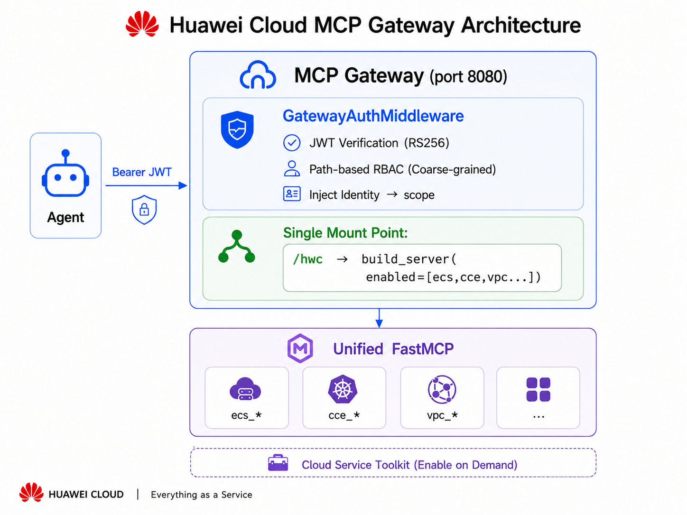

# Huawei Cloud MCP Server

[](https://www.python.org/downloads/)
[](LICENSE)
[](https://modelcontextprotocol.io/)

**English** | [中文](README.zh.md)

One MCP Server for all Huawei Cloud services. Agents connect to **one URL** and access every enabled cloud service tool. Enable only the services you need, secure production with JWT auth, and add new cloud services with **zero Agent-side config change**.

**Why unified?** Without this server, each Huawei Cloud service needs its own MCP entry — 8+ servers to configure, update, and maintain. With this server, the Agent configures **one** entry, forever. New services appear as additional tools (`obs_*`, `rds_*`, …) with no Agent-side change.

---

## Supported services

| Service | Description | Tools |
|---------|-------------|-------|
| ECS | Cloud servers | 8 |
| CodeArts Pipeline | CI/CD | 6 |
| CTS | Audit logs | 2 |
| CCE | Cloud container engine | 6 |
| LTS | Log tank service | 6 |
| CES | Cloud eye (monitoring) | 6 |
| VPC | Virtual network + security groups | 19 |
| RDS | Relational database | 10 |

**Coming soon**: OBS (object storage)…

> **63 tools total** — Per-tool details: [docs/TOOLS.md](docs/TOOLS.md)

---

## Key features

| Feature | Description |
|---------|-------------|
| Single URL | Agent configures one MCP server entry, forever |
| On-demand enable | Service-level: `MCP_ENABLED_SERVICES=ecs,pipeline`<br/>Tool-level: `MCP_INCLUDE_TOOLS` / `MCP_EXCLUDE_TOOLS` glob-filter |
| JWT auth | RS256 verification + role RBAC for production; no auth for local dev |
| Two-phase commit | Destructive ops (delete/stop/resize) require explicit user approval |
| Zero-config growth | New cloud services are server-side only, Agent is unaware |

---

## Quick start

### Prerequisites

- Python 3.10+
- [uv](https://docs.astral.sh/uv/) (recommended) or pip
- Huawei Cloud AK/SK

### 1. Install

```bash
uv sync
```

### 2. Configure

Edit `.env` in the repo root:

```bash
HUAWEICLOUD_ACCESS_KEY_ID=your-ak
HUAWEICLOUD_SECRET_ACCESS_KEY=your-sk
HUAWEICLOUD_REGION=cn-north-4
HUAWEICLOUD_PROJECT_ID=your-project-id
CODEARTS_DEFAULT_PROJECT_ID=your-codearts-project-id
```

### 3. Connect your Agent (stdio mode)

stdio mode is the simplest — no gateway, no JWT. Configure your Agent (see [Agent Configuration](#agent-configuration)) and you're done.

### 4. Start the gateway (gateway mode, optional)

> Skip this step for stdio mode.

Add to `.env`:

```bash
MCP_GATEWAY_AUTH_MODE=dev
MCP_GATEWAY_HOST=127.0.0.1
```

Start:

```bash
# Linux / macOS
./start.sh

# Windows
powershell -File start.ps1

# Or via CLI
mcp-gateway serve --manifest manifest.yaml --host 0.0.0.0 --port 8080
```

Verify:

```bash
curl http://127.0.0.1:8080/healthz
# {"status":"ok","mounted":[{"name":"huaweicloud","mount_path":"/hwc"}]}
```

---

## Agent Configuration

Use the templates below. Replace `<RUN_SCRIPT>` with the absolute path to `scripts/run-with-env.sh` (Linux/macOS) or `scripts/run-with-env.ps1` (Windows).

### stdio (local dev, recommended)

```json
{
  "mcpServers": {
    "huaweicloud": {
      "command": "<RUN_SCRIPT>",
      "timeout": 120
    }
  }
}
```

### SSE via gateway (production)

```json
{
  "mcpServers": {
    "huaweicloud": {
      "url": "http://<HOST>:<PORT>/hwc/sse",
      "transport": "sse",
      "timeout": 120,
      "headers": {
        "Authorization": "Bearer <TOKEN>"
      }
    }
  }
}
```

### Where to put the config

| Agent | Config location | Notes |
|-------|----------------|-------|
| **Hermes** | `hermes config set "mcp_servers.huaweicloud.command" <RUN_SCRIPT>` | Do NOT edit config.yaml directly |
| **Claude Code** | `~/.claude/mcp.json` | Or project-level `.claude/mcp.json` |
| **Claude Desktop** | macOS: `~/Library/Application Support/Claude/claude_desktop_config.json`<br/>Windows: `%APPDATA%\Claude\claude_desktop_config.json` | |
| **Cursor** | `~/.cursor/mcp.json` | |
| **Windsurf** | `~/.codeium/windsurf/mcp_config.json` | |
| **Cline** | VS Code Settings → Cline MCP Servers | |

### Verify

```bash
# Hermes
hermes mcp test huaweicloud
#   ✓ Connected (643ms)
#   ✓ Tools discovered: 63
```

> **Key point**: Regardless of how many Huawei Cloud services are added, the Agent always configures **one** MCP server entry. New services appear as additional tools without any Agent-side config change.

---

## Gateway architecture



Auth is handled at two layers — gateway middleware (JWT verify + path RBAC) and per-tool role checks inside the MCP server. See [docs/DEPLOY.md](docs/DEPLOY.md) for auth modes, Token CLI, and production setup.

---

## stdio mode (local dev, no gateway)

The unified server can run directly via stdio — no gateway or JWT needed:

```bash
# All services (63 tools)
huaweicloud-mcp-server

# Subset only
MCP_ENABLED_SERVICES=ecs,pipeline huaweicloud-mcp-server

# SSE mode
MCP_TRANSPORT=sse MCP_PORT=8000 huaweicloud-mcp-server
```

---

## Two-phase commit (destructive operations)

Destructive tools (stop, reboot, delete, resize, disable pipeline, update pipeline,
scale-down node pool, disassociate EIP, delete route, create manual backup)
follow a two-phase commit pattern to prevent accidental execution:

```
Phase 1: Tool call returns a preview + approval_id (TTL 120s)
         → {status: "pending_approval", approval_id: "...", preview: {...}}

Phase 2: User explicitly approves
         → ecs_confirm_destructive(approval_id="...")
         → Operation executes, returns {ok: true, data: {...}}
```

If the approval ID expires, re-issue the original call to get a fresh one.

---

## Configuration

### Core environment variables

| Variable | Required | Description |
|----------|----------|-------------|
| `HUAWEICLOUD_ACCESS_KEY_ID` | yes | Access key ID |
| `HUAWEICLOUD_SECRET_ACCESS_KEY` | yes | Secret access key |
| `HUAWEICLOUD_REGION` | yes | Region, e.g. `af-south-1` |
| `MCP_ENABLED_SERVICES` | no | Comma-separated service subset (default: all) |
| `MCP_GATEWAY_AUTH_MODE` | gateway | `jwt` (production) / `dev` (local) |

Full variable reference: [docs/CONFIGURATION.md](docs/CONFIGURATION.md) · `.env.example`

### Service & tool filtering

- **Service-level**: `MCP_ENABLED_SERVICES=ecs,pipeline` or `--enable`/`--disable` CLI flags
- **Tool-level**: `MCP_INCLUDE_TOOLS` / `MCP_EXCLUDE_TOOLS` fnmatch globs in manifest or env
- **RBAC multi-mount**: mount separate FastMCP instances per role at different paths

See [docs/CONFIGURATION.md](docs/CONFIGURATION.md) for manifest examples, RBAC patterns, and `mcp-gateway config preview`.

---

## Production deployment

- **systemd**: see `mcp-gateway/deploy/mcp-gateway.service`
- **Nginx**: TLS termination only — one `location /` rule, no changes when services are added/removed
- **JWT tokens**: `mcp-gateway token keygen` → `token create` → `token verify`

Full guide: [docs/DEPLOY.md](docs/DEPLOY.md)

---

## Adding a new Huawei Cloud service

1. Create `huaweicloud_mcp/services/<name>/` with `make_tools(settings) → dict`
2. Add `if "<name>" in enabled` branch in `server.py:build_server()`
3. Append `"<name>"` to `build_kwargs.enabled` in `manifest.yaml`
4. Restart gateway — new tools appear automatically

**No Nginx change. No gateway code change. No Agent config change.**

---

## Documentation

| Document | Content |
|----------|---------|
| [docs/TOOLS.md](docs/TOOLS.md) | Per-tool parameters, return values, role requirements |
| [docs/EXAMPLES.md](docs/EXAMPLES.md) | Agent query examples, cross-service scenarios, two-phase commit dialogs |
| [docs/CONFIGURATION.md](docs/CONFIGURATION.md) | Service/tool filtering, RBAC multi-mount, env vars, config preview |
| [docs/DEPLOY.md](docs/DEPLOY.md) | Auth layers, Token CLI, systemd, Nginx, Windows |
| [docs/ARCHITECTURE.md](docs/ARCHITECTURE.md) | Project structure, shared infrastructure, auth library, test structure |
| [CONTRIBUTING.md](CONTRIBUTING.md) | Dev setup, running tests, adding services |

---

## License

MIT
