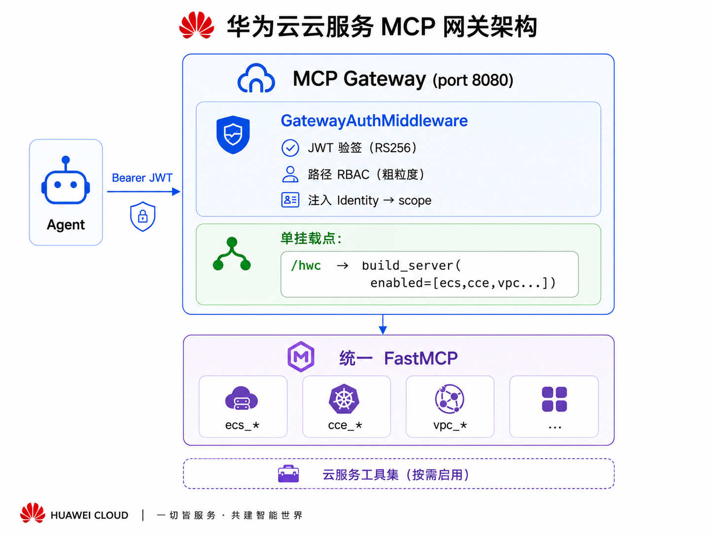

# 华为云 MCP Server

[](https://www.python.org/downloads/)
[](LICENSE)
[](https://modelcontextprotocol.io/)

[English](README.md) | **中文**

一个 MCP Server 覆盖全部华为云服务。Agent 只需对接 **一个 URL**，即可访问所有已启用的云服务工具。按需启动服务子集，JWT 鉴权保障生产安全，新增云服务无需 Agent 侧任何配置变更。

**为什么统一？** 没有此 Server 时，每个华为云服务需要独立的 MCP 条目——8+ 个 Server 要配置、更新、维护。使用此 Server 后，Agent 只需配置**一个**条目，永久不变。新服务以新工具名（`obs_*`、`rds_*`、…）自动出现，无需 Agent 侧任何变更。

---

## 已支持服务

| 服务 | 说明 | 工具数 |
|------|------|--------|
| ECS | 云主机 | 8 |
| CodeArts Pipeline | 流水线（CI/CD） | 6 |
| CTS | 审计日志 | 2 |
| CCE | 云容器引擎 | 6 |
| LTS | 日志服务 | 6 |
| CES | 云监控 | 6 |
| VPC | 虚拟网络 + 安全组 | 19 |
| RDS | 关系数据库 | 10 |

**开发中**：OBS（对象存储）…

> **共 63 个工具** — 各工具详细说明见 [docs/TOOLS.zh.md](docs/TOOLS.zh.md)

---

## 核心特性

| 特性 | 说明 |
|------|------|
| 单 URL 对接 | Agent 配置一个 MCP Server 条目，永久不变 |
| 按需启用 | service 级：`MCP_ENABLED_SERVICES=ecs,pipeline`<br/>tool 级：`MCP_INCLUDE_TOOLS` / `MCP_EXCLUDE_TOOLS` glob 裁剪 |
| JWT 鉴权 | 生产环境 RS256 签验 + 角色 RBAC；本地开发免鉴权 |
| 两阶段提交 | 破坏性操作（删除/关机/变更规格）需用户显式确认 |
| 零配置扩展 | 新增云服务只改服务端，Agent 无感知 |

---

## 快速开始

### 前置条件

- Python 3.10+
- [uv](https://docs.astral.sh/uv/)（推荐）或 pip
- 华为云 AK/SK

### 1. 安装

```bash
uv sync
```

### 2. 配置

编辑根目录 `.env`：

```bash
HUAWEICLOUD_ACCESS_KEY_ID=your-ak
HUAWEICLOUD_SECRET_ACCESS_KEY=your-sk
HUAWEICLOUD_REGION=cn-north-4
HUAWEICLOUD_PROJECT_ID=your-project-id
CODEARTS_DEFAULT_PROJECT_ID=your-codearts-project-id
```

### 3. 连接 Agent（stdio 模式）

stdio 模式最简单——无需网关、无需 JWT。配置好 Agent（见下方 [Agent 配置](#agent-配置)）即可使用。

### 4. 启动网关（网关模式，可选）

> stdio 模式跳过此步骤。

在 `.env` 中追加：

```bash
MCP_GATEWAY_AUTH_MODE=dev
MCP_GATEWAY_HOST=127.0.0.1
```

启动：

```bash
# Linux / macOS
./start.sh

# Windows
powershell -File start.ps1

# 或通过 CLI
mcp-gateway serve --manifest manifest.yaml --host 0.0.0.0 --port 8080
```

验证：

```bash
curl http://127.0.0.1:8080/healthz
# {"status":"ok","mounted":[{"name":"huaweicloud","mount_path":"/hwc"}]}
```

---

## Agent 配置

使用下方模板，将 `<RUN_SCRIPT>` 替换为 `scripts/run-with-env.sh`（Linux/macOS）或 `scripts/run-with-env.ps1`（Windows）的绝对路径。

### stdio（本地开发，推荐）

```json
{
  "mcpServers": {
    "huaweicloud": {
      "command": "<RUN_SCRIPT>",
      "timeout": 120
    }
  }
}
```

### SSE via 网关（生产）

```json
{
  "mcpServers": {
    "huaweicloud": {
      "url": "http://<HOST>:<PORT>/hwc/sse",
      "transport": "sse",
      "timeout": 120,
      "headers": {
        "Authorization": "Bearer <TOKEN>"
      }
    }
  }
}
```

### 配置文件位置

| Agent | 配置位置 | 备注 |
|-------|---------|------|
| **Hermes** | `hermes config set "mcp_servers.huaweicloud.command" <RUN_SCRIPT>` | 不要直接编辑 config.yaml |
| **Claude Code** | `~/.claude/mcp.json` | 或项目级 `.claude/mcp.json` |
| **Claude Desktop** | macOS: `~/Library/Application Support/Claude/claude_desktop_config.json`<br/>Windows: `%APPDATA%\Claude\claude_desktop_config.json` | |
| **Cursor** | `~/.cursor/mcp.json` | |
| **Windsurf** | `~/.codeium/windsurf/mcp_config.json` | |
| **Cline** | VS Code 设置 → Cline MCP Servers | |

### 验证

```bash
# Hermes
hermes mcp test huaweicloud
#   ✓ Connected (643ms)
#   ✓ Tools discovered: 63
```

> **核心要点**：无论未来新增多少华为云服务，Agent 始终只需配置**一个** MCP Server 条目。新服务以新工具名自动出现，无需 Agent 侧任何配置变更。

---

## 网关架构



鉴权分两层——网关中间件（JWT 验签 + 路径 RBAC）和 MCP Server 内按工具名做角色检查。详见 [docs/DEPLOY.zh.md](docs/DEPLOY.zh.md)。

---

## stdio 模式（本地开发，无需网关）

统一 Server 可直接通过 stdio 运行，无需网关或 JWT：

```bash
# 全部服务（63 个工具）
huaweicloud-mcp-server

# 仅启用子集
MCP_ENABLED_SERVICES=ecs,pipeline huaweicloud-mcp-server

# SSE 模式
MCP_TRANSPORT=sse MCP_PORT=8000 huaweicloud-mcp-server
```

---

## 两阶段提交（破坏性操作）

破坏性工具（关机、重启、删除、变更规格、禁用流水线、修改流水线、缩容节点池、解绑 EIP、删除路由、创建手动备份）遵循两阶段提交模式，防止误操作：

```
阶段 1: 工具调用返回预览 + approval_id（TTL 120 秒）
         → {status: "pending_approval", approval_id: "...", preview: {...}}

阶段 2: 用户显式确认
         → ecs_confirm_destructive(approval_id="...")
         → 操作执行，返回 {ok: true, data: {...}}
```

若 approval_id 过期，重新发起原始调用获取新的 ID。

---

## 配置

### 核心环境变量

| 变量 | 必需 | 说明 |
|------|------|------|
| `HUAWEICLOUD_ACCESS_KEY_ID` | 是 | Access Key ID |
| `HUAWEICLOUD_SECRET_ACCESS_KEY` | 是 | Secret Access Key |
| `HUAWEICLOUD_REGION` | 是 | 区域，如 `af-south-1` |
| `MCP_ENABLED_SERVICES` | 否 | 逗号分隔的服务子集（默认：全部） |
| `MCP_GATEWAY_AUTH_MODE` | 网关 | `jwt`（生产）/ `dev`（本地） |

完整变量参考：[docs/CONFIGURATION.zh.md](docs/CONFIGURATION.zh.md) · `.env.example`

### 服务与工具过滤

- **service 级**：`MCP_ENABLED_SERVICES=ecs,pipeline` 或 CLI `--enable`/`--disable`
- **tool 级**：`MCP_INCLUDE_TOOLS` / `MCP_EXCLUDE_TOOLS` fnmatch glob，在 manifest 或环境变量中设置
- **RBAC 多挂载点**：按角色挂载不同 FastMCP 实例到不同路径

详见 [docs/CONFIGURATION.zh.md](docs/CONFIGURATION.zh.md)，含 manifest 示例、RBAC 模式和 `mcp-gateway config preview`。

---

## 生产部署

- **systemd**：见 `mcp-gateway/deploy/mcp-gateway.service`
- **Nginx**：仅 TLS 终结——一条 `location /` 规则，增删服务无需改动
- **JWT Token**：`mcp-gateway token keygen` → `token create` → `token verify`

完整指南：[docs/DEPLOY.zh.md](docs/DEPLOY.zh.md)

---

## 新增华为云服务

1. 在 `huaweicloud_mcp/services/<name>/` 下创建 `make_tools(settings) → dict`
2. 在 `server.py:build_server()` 中添加 `if "<name>" in enabled` 分支
3. 在 `manifest.yaml` 的 `build_kwargs.enabled` 中追加 `"<name>"`
4. 重启网关 — 新工具自动出现

**无需改 Nginx。无需改网关代码。无需改 Agent 配置。**

---

## 文档

| 文档 | 内容 |
|------|------|
| [docs/TOOLS.zh.md](docs/TOOLS.zh.md) | 各工具参数、返回值、角色要求 |
| [docs/EXAMPLES.zh.md](docs/EXAMPLES.zh.md) | Agent 提问案例、跨服务场景、两阶段确认对话模板 |
| [docs/CONFIGURATION.zh.md](docs/CONFIGURATION.zh.md) | 服务/工具过滤、RBAC 多挂载点、环境变量、配置预览 |
| [docs/DEPLOY.zh.md](docs/DEPLOY.zh.md) | 鉴权分层、Token CLI、systemd、Nginx、Windows |
| [docs/ARCHITECTURE.zh.md](docs/ARCHITECTURE.zh.md) | 项目结构、共享基础设施、鉴权库、测试结构 |
| [CONTRIBUTING.md](CONTRIBUTING.md) | 开发环境、运行测试、新增服务 |

---

## 许可证

MIT
